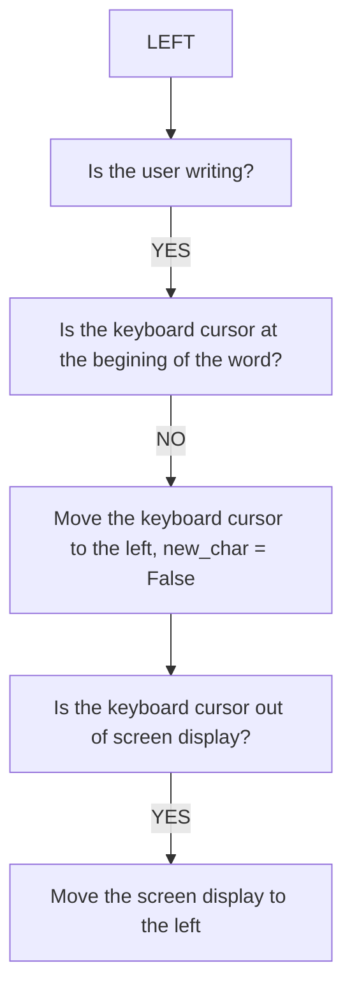
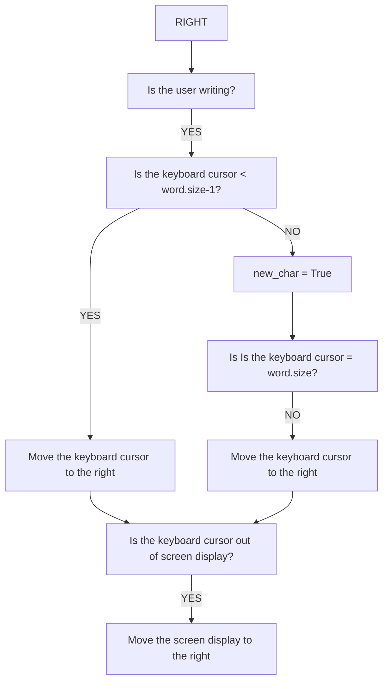
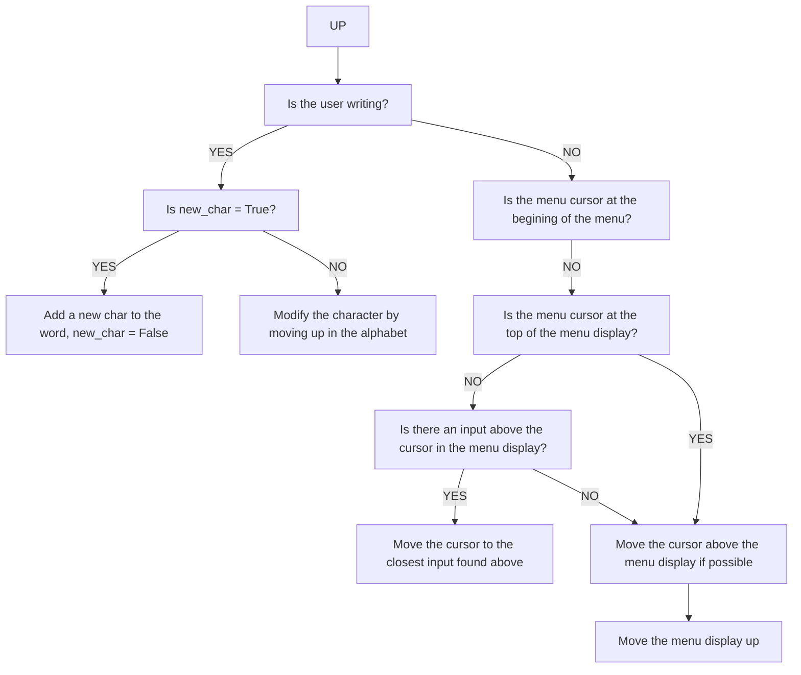
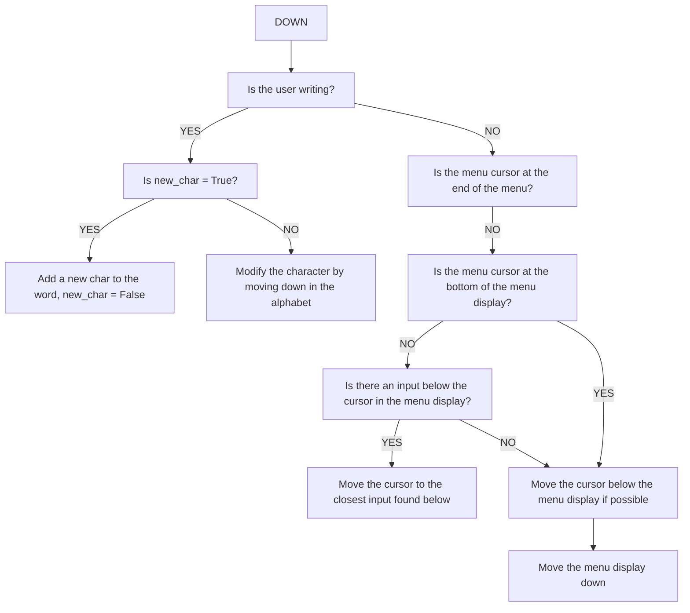
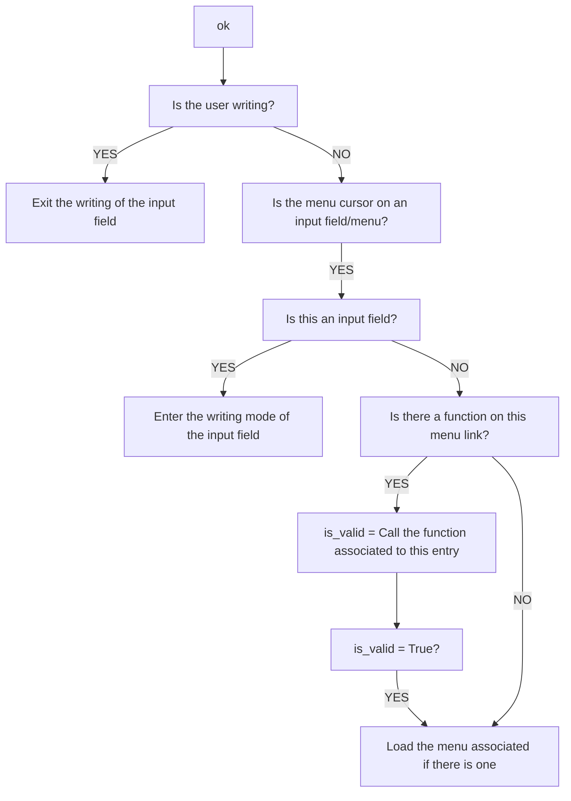
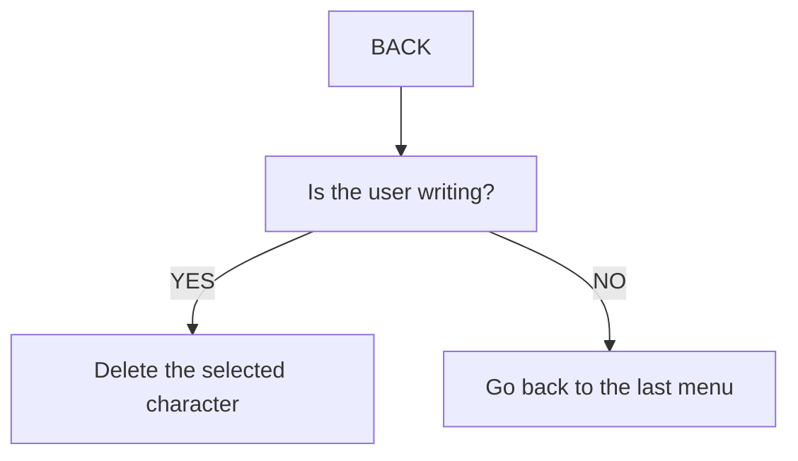

# Inputs:

## LEFT:

```mermaid
graph TD
input_left[LEFT] --> cond1[Is the user writing?]
cond1-- YES -->cond2[Is the keyboard cursor at the begining of the word?]
cond2-- NO -->go_left[Move the keyboard cursor to the left, new_char = False]
go_left-->cond3[Is the keyboard cursor out of screen display?]
cond3-- YES -->move_left[Move the screen display to the left]
```

## RIGHT:

```mermaid
graph TD
input_right[RIGHT] --> cond1_1[Is the user writing?]
cond1_1-- YES -->cond2_1[Is the keyboard cursor < word.size-1?]
cond2_1-- NO -->cond4_1[new_char = True]
cond4_1-->cond5_1[Is Is the keyboard cursor = word.size?]
cond5_1-- NO -->cond6_1[Move the keyboard cursor to the right]
cond2_1-- YES -->go_right[Move the keyboard cursor to the right]
go_right-->cond3_1[Is the keyboard cursor out of screen display?]
cond3_1-- YES -->move_right[Move the screen display to the right]
cond6_1-->cond3_1
```

## UP:

```mermaid
graph TD
input_right[UP] --> cond1[Is the user writing?]
cond1-- YES -->cond2[Is new_char = True?]
cond2-- YES -->cond3[Add a new char to the word, new_char = False]
cond2-- NO -->cond4[Modify the character by moving up in the alphabet]
cond1-- NO -->cond5[Is the menu cursor at the begining of the menu?]
cond5-- NO -->cond6[Is the menu cursor at the top of the menu display?]
cond6-- NO -->cond7[Is there an input above the cursor in the menu display?]
cond7-- YES -->cond8[Move the cursor to the closest input found above]
cond7-- NO -->cond9[Move the cursor above the menu display if possible]
cond9-->move_up[Move the menu display up]
cond6-- YES -->cond9
```

## DOWN:

```mermaid
graph TD
input_right[DOWN] --> cond1[Is the user writing?]
cond1-- YES -->cond2[Is new_char = True?]
cond2-- YES -->cond3[Add a new char to the word, new_char = False]
cond2-- NO -->cond4[Modify the character by moving down in the alphabet]
cond1-- NO -->cond5[Is the menu cursor at the end of the menu?]
cond5-- NO -->cond6[Is the menu cursor at the bottom of the menu display?]
cond6-- NO -->cond7[Is there an input below the cursor in the menu display?]
cond7-- YES -->cond8[Move the cursor to the closest input found below]
cond7-- NO -->cond9[Move the cursor below the menu display if possible]
cond9-->move_up[Move the menu display down]
cond6-- YES -->cond9
```

## OK:

```mermaid
graph TD
ok[ok]-->cond1[Is the user writing?]
cond1-- YES -->exit[Exit the writing of the input field]
cond1-- NO -->cond2[Is the menu cursor on an input field/menu?]
cond2-- YES -->cond3[Is this an input field?]
cond3-- YES -->writing[Enter the writing mode of the input field]
cond3-- NO -->cond4[Is there a function on this menu link?]
cond4-- YES -->funct[is_valid = Call the function associated to this entry]
funct-->cond5[is_valid = True?]
cond5-- YES -->link[Load the menu associated if there is one]
cond4-- NO -->link
```

## BACK:

```mermaid
graph TD
back[BACK]-->cond1[Is the user writing?]
cond1-- YES -->exit[Delete the selected character]
cond1-- NO -->cond2[Go back to the last menu]
```

