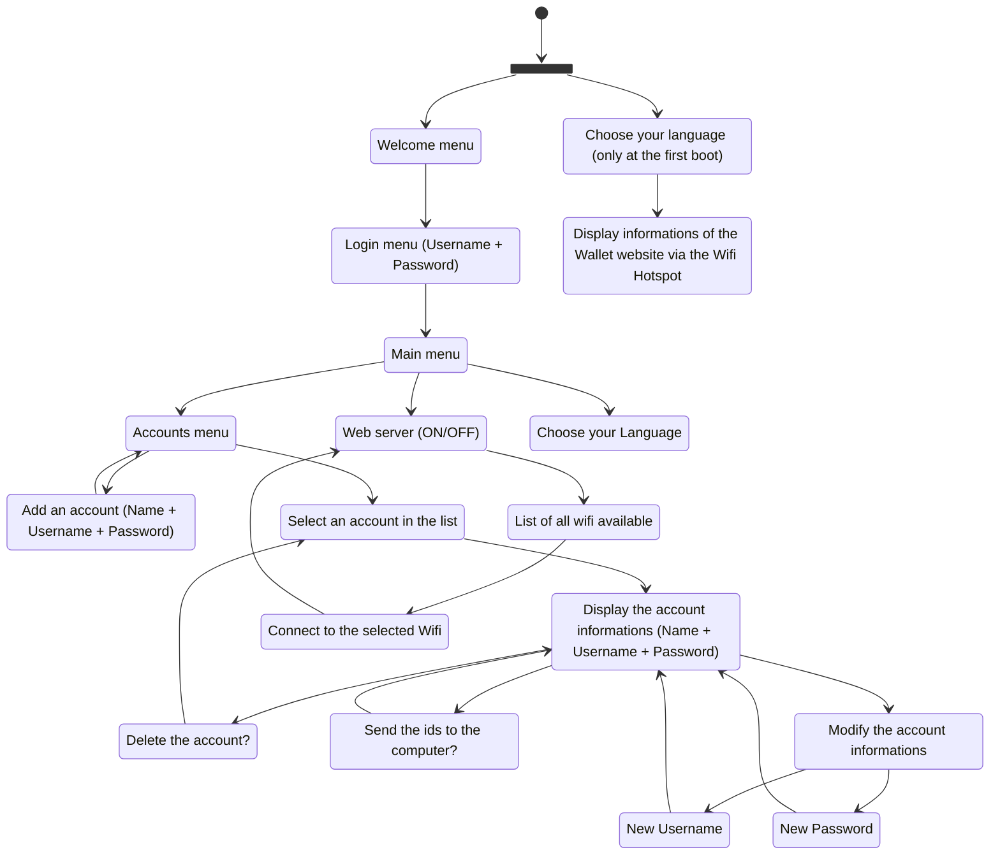

# MENU:

```mermaid
stateDiagram
state fork_state <<fork>>
First_boot : Choose your language (only at the first boot)
Welcome_menu : Welcome menu
Login : Login menu (Username + Password)
Main_menu : Main menu
Web_server : Web server (ON/OFF)
Accounts_menu : Accounts menu
Add_account : Add an account (Name + Username + Password)
Account_selection : Select an account in the list
Display_account : Display the account informations (Name + Username + Password)
Delete_account : Delete the account?
Send_to_computer : Send the ids to the computer?
Modify_account : Modify the account informations
New_username : New Username
New_password : New Password
Language : Choose your Language
connect_wifi : Connect to the selected Wifi
wifi_list : List of all wifi available
Wifi_Hotspot : Display informations of the Wallet website via the Wifi Hotspot

[*] --> fork_state
fork_state --> First_boot
fork_state --> Welcome_menu
First_boot --> Wifi_Hotspot
Welcome_menu --> Login
Login --> Main_menu
Main_menu --> Web_server
Main_menu --> Accounts_menu
Main_menu --> Language
Accounts_menu --> Add_account
Add_account --> Accounts_menu
Accounts_menu --> Account_selection
Account_selection --> Display_account
Display_account --> Delete_account
Delete_account --> Account_selection
Display_account --> Send_to_computer
Send_to_computer --> Display_account
Display_account --> Modify_account
Modify_account --> New_username
Modify_account --> New_password
New_username --> Display_account
New_password --> Display_account
Web_server --> wifi_list
wifi_list --> connect_wifi
connect_wifi --> Web_server
```

