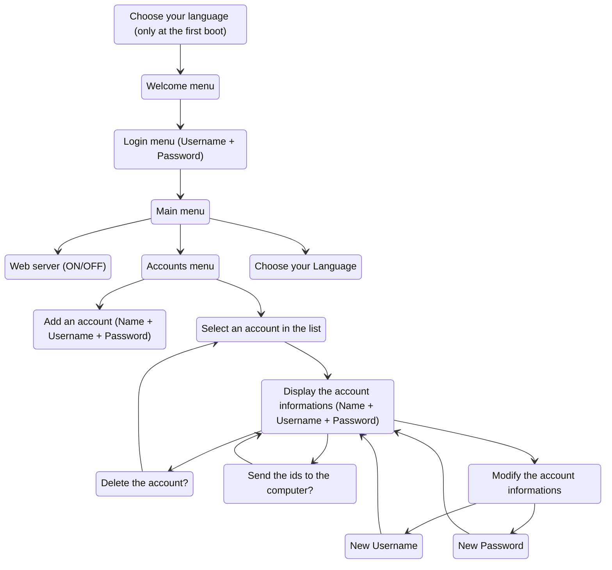
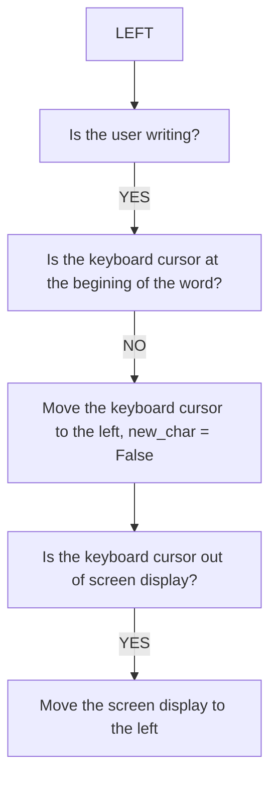
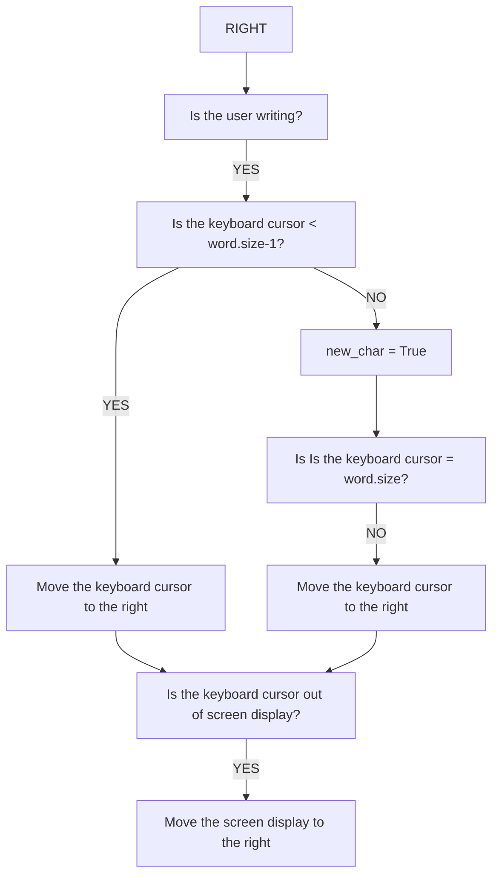
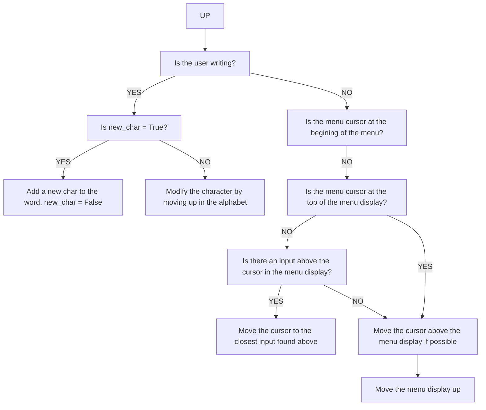
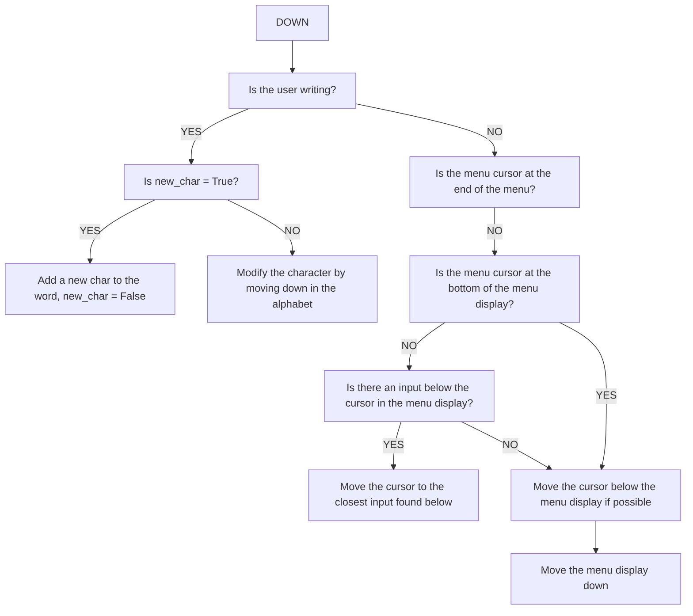
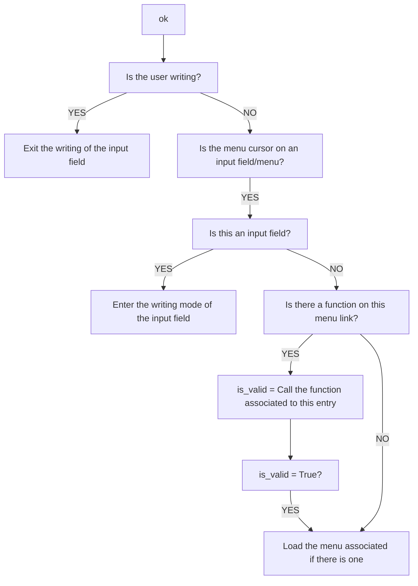
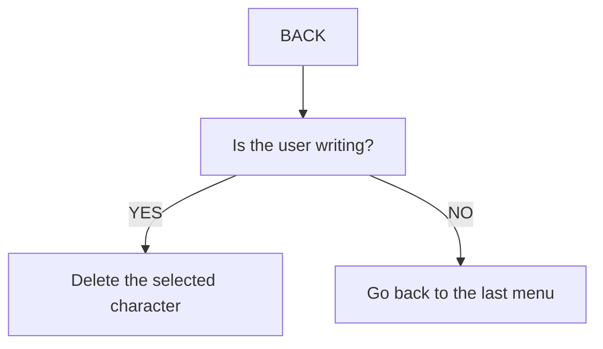

# README

## Menu structure:



## Inputs:

### LEFT:



### RIGHT:



### UP:



### DOWN:



### OK:



### BACK:



## Class structure:

```mermaid
 classDiagram
      class Screen
      Screen : -display : Adafruit_SSD1306 
      Screen : +Screen()
      Screen : +~Screen()
      Screen : +clear()
      Screen : +setLine()
      Screen : +show()
      
      class View
      View : -screen : Screen*
      View : -buffer : char[NUM_LINE][LUM_COL] 
      View : +View()
      View : +~View()
      View : +clear()
      View : +show()
      View : +draw_text()
      View : +draw_char()
      View : +clear_buffer()
      
      class Model
      Model : -lang_folder : string
      Model : -unlocked_locker : vector<string>
      Model : -user_ids : vector<string>
      Model : +Model()
      Model : +~Model()
      Model : +read()
      Model : +get_accounts()
      Model : +get_account()
      Model : +add_account()
      Model : +modify_account_password()
      Model : +modify_account_username()
      Model : +delete_account()
      Model : +is_webserver_on()
      Model : +switch_server_status()
      Model : +login()
      Model : +get_config()
      Model : +set_config()
      
      class Inputs
      Inputs : +Inputs()
      Inputs : +~Inputs()
      Inputs : +has_input()
      Inputs : +get_input()
      
      class Keyboard
      Keyboard : +Alphabet : vector<char>
      Keyboard : +Keyboard()
      Keyboard : +~Keyboard()
      Keyboard : +up()
      Keyboard : +down()
      Keyboard : +left()
      Keyboard : +right()
      Keyboard : +del()
      Keyboard : +add()
      Keyboard : +get_display()
      
      class Controller
      Controller : -view : View*
      Controller : -model : Model*
      Controller : -keyboard : Keyboard*
      Controller : -inputs : Inputs*
      Controller : -spf : SPIFFS
      Controller : -cursor_position : int
      Controller : -line_number_of_choices : vector<int>
      Controller : -menu_lines : vector<string>
      Controller : -buffer : vector<int>
      Controller : -current_menu : string
      Controller : -selected_account : int
      Controller : -inputs_function : vector<vector<string>>
      Controller : -inputs_link : vector<string>
      Controller : -input_fields : map<string, string>
      Controller : -language : string
      Controller : -first_boot : bool
      Controller : -update_display()
      Controller : -load_menu()
      Controller : -init_buffer()
      Controller : -select_choice()
      Controller : -go_back()
      Controller : -write()
      Controller : -scroll()
      Controller : +Controller()
      Controller : +~Controller()
      Controller : +update()
      
      Screen <-- View : screen
      View <-- Controller : view
      Model <-- Controller : model
      Inputs <-- Controller : inputs
      Keyboard <-- Controller : keyboard
```

## Menu files .struct

### Each line is described by: LINE_NUMBER LINE_TYPE ARG1 ARG2 ARG3 ARG4
- LINE_NUMBER: The number of the correspong menu line (starting from 0)
- LINE_TYPE: It is a character describing the type of the line ('t' for plain text,'>' for direct menu link, '<' for an input field, 'f' for a function to execute before going to a menu, 'g' to get an information at the loading of the menu and display it)
- ARGs: Arguments, their number depends on the function used

### exemples:
```
0 t //Display plain text
1 > menu1  //Direct link to the menu1
2 < name_of_input //Input Field name: name_fo_input
3 f menu1 funct1 name_of_arg1 name_of_arg2 name_of_arg3 //Go to the menu1 after calling the funct1
4 g funct2 //Call the funct2 at the loading of the current menu
```

Login.txt:
```
Connection:
user:

password:

Login
```
Login.struct:
```
0 t
1 t
2 < user
3 t
4 < password
5 f Main_menu login user password
```

### List of input fields:
- user: Name of the user of the Vault
- username: Name of the user of the account
- name: Name/URL of the account
- password: password of the Vault or password of the account

### List of funct1 and their arguments:
- add_account name username password
- deleteAccount
- login user password
- logoff
- setAccountPassword password
- setAccountUsername username
- sendToComputer
- switch_ServerStatus
- set_Lang language(FR, EN, GE...)

### List of funct2:
- getAccountlist
- getAccountName
- getAccountUsername
- getAccountPassword
- getServerStatus